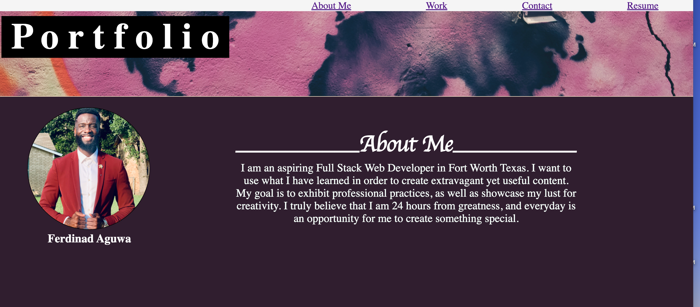

# Ferdinad Aguwa - Portfolio

## Description
Here is the beginnig of my development as a web developer. I have created a portfolio with some prework assignments that I worked on before class began. I included advanced elements that i learned in class such as psudo elements, the hoover tool and media queries. The page should take you to various social sites at the bottom of the page, and give the user a good perspective about me. 

## Table of Contents
* [License](#license)
* [Pitch](#pitch)
* [Contributing](#contributing)
* [Links](#Links)
* [Tenchnologies](#Technologies)
* [Developer](#Developer)
## License
MIT
## Contributing
No contributions allowed  
## Links
* GitHub repository URL: https://github.com/FerdinadAguwa
## Technologies
### Languages
* HTML, CSS
### FrameWorks
* Visual Studio Code
## Page Preview
* Screenshots

## Developer
### Ferdinad Aguwa 
* Github username: FerdinadAguwa
* Email: ferd.aguwa@yahoo.com

